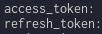

# auto-download-pixiv-bookmark-images

pixivのブックマーク画像を全部ダウンロードしてくるやつ

注意：pixivpyは公式のAPIではないのでどうなっても知らないです。誰も責任はとりません。ご了承ください。

# Requirement
* python3
* pip3

# Setup
```bash
$ git clone https://github.com/Genshi0916/auto-download-pixiv-bookmark-images.git
$ cd auto-download-pixiv-bookmark-images
$ pip3 install selenium
$ pip3 install pixivpy
```

## Get Refresh Token
pixivのユーザー認証の仕様が変わったため導入が面倒になっています

chrome右上のメニュー / 設定 / chromeについて からそのバージョンに対応するchromedriverを[こちら](https://chromedriver.chromium.org/downloads)からダウンロードしてきてgetRefreshTokenフォルダに入れてターミナルで下のコマンドを実行してください

```bash
$ cd auto-download-pixiv-bookmark-images/getRefreshToken
$ ls #README.md chromedriver pixiv_auth.py
$ python3 pixiv_auth.py login
```
実行するとログインページが出てくるのでダウンロードしたいブックマークの画像があるアカウントでログインします

ログインするとターミナルにaccess_tokenとrefresh_tokenが表示されます



refresh_token取得の説明が分かりにくかった場合はpixivpy製作者の説明の記事をご覧ください
[https://gist.github.com/upbit/6edda27cb1644e94183291109b8a5fde](https://gist.github.com/upbit/6edda27cb1644e94183291109b8a5fde)

## Setting the key.py
先程取得したrefresh_tokenとご自身のpixivのユーザーID (pixiv.net/users/?????/ の?????の部分の数字)でkey.pyを書き換えてください

```python
REFRESH_TOKEN = "Insert your refresh token."
USER_ID = "Insert your pixiv user ID."
```

これでdownload.pyからダウンロードできるようになります

## Start the download
上記の設定が終わればターミナルで下のコマンドを実行してください
```bash
$ cd auto-download-pixiv-bookmark-images
$ python3 download.py
```
# Attention
ダウンロードしてきた画像ですが、僕の環境(ubuntu)だとデフォルトの画像ビューアーで画像を読み込むことができませんでした。(gimpとかなら読み込める、謎)

windows10は大丈夫でした。Mac OSは持っていないのでわかりません。

ubuntuで実行した場合、別の画像ビューアーを使ったりしていい感じにしてください(gThumbなら闇込めました)。

# References
* https://github.com/upbit/pixivpy
* https://gist.github.com/upbit/6edda27cb1644e94183291109b8a5fde
* https://qiita.com/perlverity/items/a6bd388d96cb4ce69692
